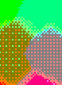
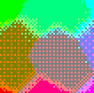

# Dithering help

## Source

### Gradient

Gradients are very useful for dither demonstrations.

#### Interpolation space

Normally you'll use a perceptual space (OKLCH or OKLab). Defines the coordinate system
used for the bilinear interpolation.

#### Palette definition

You can drag Lospec URLs or slugs into the box to import a lospec palette.

Or define your own. The first 4 colors determine the corners of the gradient; the rest are ignored.

Sample palettes are available to choose from.

### Image

Can drag URLs, paste image data, or select an example image.

## Reduction Palette

This area defines the reduced palette which motivates dithering. Preset palettes are available,
also lospec import.

## Source Adjustments

Here's where things get fun. Dithering will take a source image, apply some kind of jitter, and then snap to the target palette. Adjustments made on the source image can help the palette reduction
process go smoother, control detail and spread across the target palette.

Concept: We assume the source image is using many more colors than the target palette.
So in an ideal case, the target palette contains the most representative colors of the source,
and more importantly, utilization of the target palette is then uniform (all colors used, and
all the same amount -- no colors left out or monopolizing the result).

In order to help this happen, we do adjustments.

### Gamut fitting

Look at the 3D scatter plot showing the source image and the target palette.
When these are similar, you're going to get a good result. When there is no overlap between them,
you're going to get unrecognizable trash.

This processing stage attempts to adjust the source image in a way that helps the
final image have clarity and detail, while trying to retain its character.

#### translation & Scaling (Gamma fit)

We try to take the source image colors, and translate & scale them in the
palette reduction color space, to closer match the target palette's colors. For this,
we calculate the centroid of the palette to determine translation.
And we use the spread over the axes (std dev) to calculate the source / target "size".

This goes a long way in getting a more even distribution, and utilizes the perception-based color spaces.

However actual results are a bit context dependent. Effectiveness depends a lot on
*how* the palette fits the source, and the character of the source & palette.

These transforms can also affect hue so basically there's a tradeoff to balance.

#### rotation

We also attempt to find a rotation, but i'm not convinced it has a useful effect.
Even though rotation in theory helps uniformity by projecting the gamut shape better
on the target, issues:

1. i'm not certain this algo is finding a good rotation. Looking at the gamut plot, it often doesn't go towards what i'd expect. things get worse way more often than they get better.
2. i'm guessing rotation will easily lead you away from the perception quality that intends to enhance.
3. it may be necessary to restrict rotation to certain axes

Where I did notice it helping is to just nudge the colors away from a bad fit.
More likely luck than strategy.

TODO: find better rotation, refine this and find good test material for it.

### Palette Nudging

This is more subtle, and tbh i am not sure it's that necessary.

The idea is: When the dither jitter is applied to ambiguous colors, it can cause
those colors to snap to a different palette entry than it should go. If we just
nudge those ambiguous colors towards the *actual* nearest color (and not the
palette entry nearest the color+jitter), then you'll get more accurate result.

We should see very slightly less stippling because colors are already closer to
where they should be.

For colors that already know where to snap to, this doesn't have an effect.

Basically it serves as the tie-breaker for source colors that are ambiguous (could tip one color or another).

So to test this you'd need a source color that's basically in the middle between
two palette entry colors. Without palette nudging, the threshold between the colors
(where the dithering is strongest) will be slightly more strong than it needs to be strictly.
So by nudging the source towards a color before applying jitter, it reduces the need
for stippling in a way that retains the original intent.

Reality check though, i did not find a single example where i found the result
to be better. I can contrive an example basically by finding a random place where
this nudging works out to be nice effect. But it would often be better to just leave
it off, and change dither strength instead.

Ok i finally found a situation where this genuinely helps...

Without palette nudging:

With palette nudging:

Solid flat swatches demonstrate the effect best. Here you see how a mostly unrelated color gets selected, but by nudging the color first towards the correct direction, we reduce that extreme
stippling effect.

#### Direction radius

When calculating the direction we should nudge a color, only consider colors within this radius.
Mostly a performance knob; in theory you can consider all colors (r=1).

#### Ambiguity curve

Strength of this effect is scaled by a color's "ambiguity" which is calculated by its 2 nearest
palette matches. If they are both similar distance away, this is quite ambiguous and the effect
is stronger. But that strength is nonlinear; this defines an exponent for the curve.

See the gamut plot to see how it affects magnetic attraction.

#### Nearest colors

Again mostly just a performance knob - defines how many colors to consider when calculating
nudge direction. Too many and the effect may not be useful; too few and this effect loses meaning
because we need to deal with tie breakers, not just pick the closest one. Honestly 2 or 3 is probably
enough.

### Dither Masking

The idea is to dynamically adjust dither strength over the image, depending on its contents. For ordered dithering, It gets really messy / noisy when high frequency content also has a bunch of
dithering stippling added. In that case, whatever detail the dithering is attempting to bring out
only shows as noise.

So, we blur the image, and take the difference between the blurred color vs. non-blurred color.
The bigger that difference is, the higher frequency we assume at that pixel location.

High frequencies mean attenuating dither amount. The result is less noisy high frequency content,
without sacrificing those smooth gradients. Especially useful when there are sharp details but
also gradients that don't have strong match in the target palette (necessitating strong dither).
Faces are a good example.

#### Blur radius

Probably keep it small; basically the rough size of detail you want. With ordered dithering, we're talking pixel art so probably 3-8 pixels. Too much and the loss of detail spills out into
low frequency areas.

### Dither Masking based on error & ambiguity.

This modulates dither strength by error & ambiguity metrics. These metrics are similar to the palette nudging system.
Error is the distance from a source color to the nearest target palette entry. Ambiguity is whether multiple colors are competing for a match.

The idea is that when a source color is very close to the target palette (low error), then we don't need much dithering.

And ambiguity is mixed in, amplifying dither strength so the dither jitter is allowed to reach the candidate colors.

The is effective in allowing higher dither strength without the image getting overly "stipply".

# TODO

- figure out why many color models don't play nicely at all with distance functions when i'd expect them to. Gamut plot feels wrong as well.
- dither strength dynamically depending on distance to palette entries.
- in general explore auto dither strength. better scaling for this effect. re-explore the idea holistically using the techinques explored.
- optimization towards perception delta max.
    - add delta preview images
    - next to params allow a sweep across the param range, showing images for N variations over that param range. Maybe even a 2D grid (4x4, 5x5?). show graphs of perceptual delta.
    

